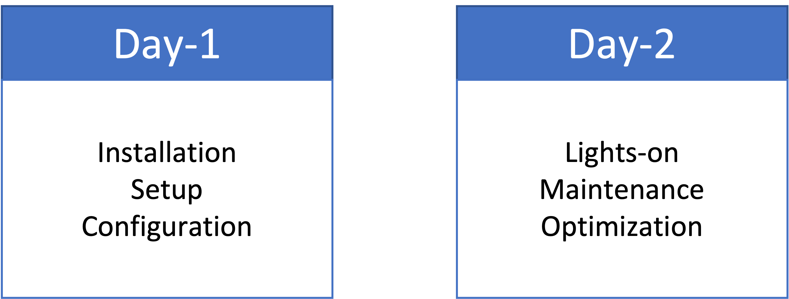
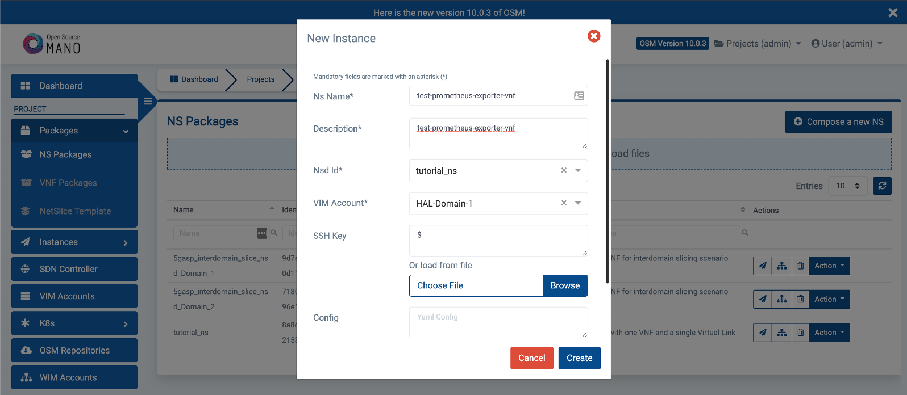
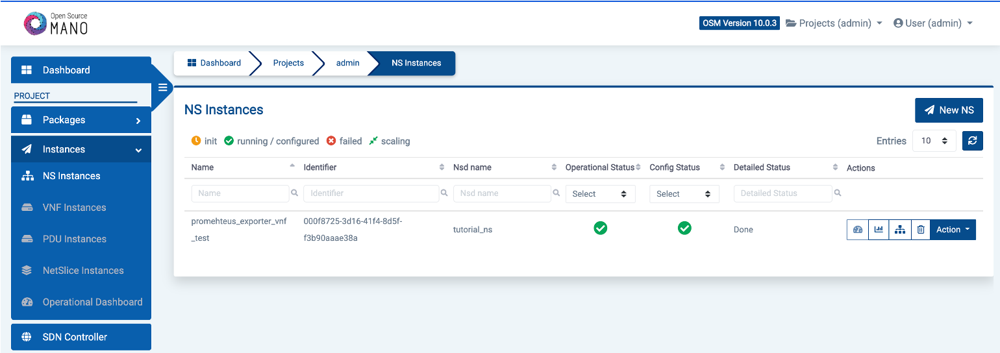
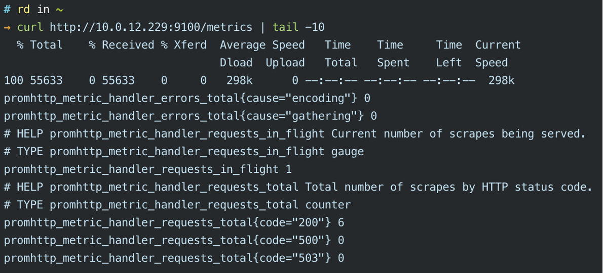
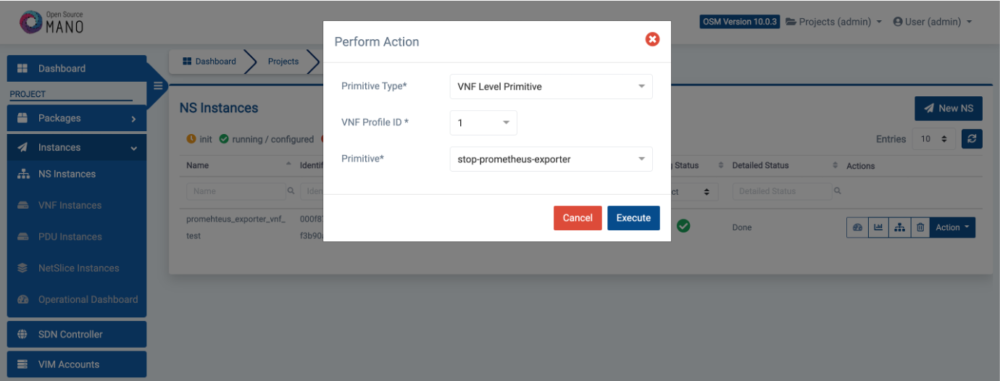
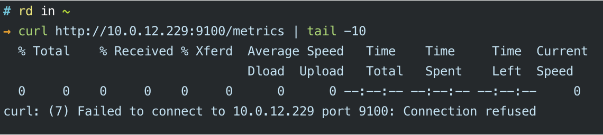

# Day-1 and Day-2 VNF Operations

### Day-1 vs Day-2

* Day-1 is when you provide the guidelines to include all necessary elements in the VNF package to allow the services to be automatically initialized. 
* Day-2 operations are designed to provide maintenance, like reconfiguration of services and monitoring.




### Code Used

This tutorial uses code from previous tutorials:

* VNF developed in "Build your VNF from scratch";
* Juju Charm developed in "Introducing OSM primitives and Juju Charms".

Both are available [here](https://github.com/5gasp/tutorials)

### Code modifications

#### Basic structure

The first step is to download the resources from the previous tutorials.

```bash
# download the base VNF and NS
$ curl https://codeload.github.com/5gasp/tutorials/tar.gz/master |  tar -xz --strip=2 tutorials-master/1-build_your_vnf_from_scratch/outputs
# organize your file structure
$ mv outputs/* .
$ rm outputs –d
# add the base juju charm to the VNF file structure
$ cd tutorial_vnf
$ curl https://codeload.github.com/5gasp/tutorials/tar.gz/master |  tar -xz --strip=2 tutorials-master/2-introducing_osm_primitives_and_juju_charms
# since there were some references to git repositories in the juju charm, you might have to clone these reference repositories again. 
# To do so, execute:
$ cd tutorial_vnf/charms/prometheus-node-exporter
$ rm –rf hooks lib mod
$ mkdir hooks lib mod
$ ln -s ../src/charm.py hooks/upgrade-charm
$ ln -s ../src/charm.py hooks/install
$ ln -s ../src/charm.py hooks/start 
$ git clone https://github.com/canonical/operator mod/operator 
$ git clone https://github.com/charmed-osm/charms.osm mod/charms.osm
$ ln -s ../mod/operator/ops lib/ops 
$ ln -s ../mod/charms.osm/charms lib/charms
```

Notice that you are recreating the content of `mod/operator` and `mod/charms.osm`. This is not entirely mandatory, but if you don’t do this you might encounter some problems later, since the content of theses two directories was added via a git submodule.

After running these commands, you should have the following structure (using the `tree` command):

```bash
└── day1_day2_tutorial
    ├── tutorial_ns
    │   └── …
    └── tutorial_vnf
          ├── charms
          │    └── …
          ├── cloud_init
          │    └── …
         ├── tutorial_vnfd.yaml
         ├── checksums.txt
         └── README.md
```

<div style="page-break-after: always;"></div>

#### VNF Descriptor

file: `tutorial_vnf/tutorial_vnfd.yaml`

Add the following content:

```yaml
vnfd:
  description: A basic VNF descriptor with one VDU
  df:
  - id: default-df
    ...
    ...
    # Juju/LCM Actionns
    lcm-operations-configuration:
      operate-vnf-op-config:
        day1-2:
        - config-primitive:
          - name: start-prometheus-exporter
            execution-environment-ref: configure-vnf
          - name: stop-prometheus-exporter
            execution-environment-ref: configure-vnf
          id: tutorial_vnf
          execution-environment-list:
          - id: configure-vnf
            external-connection-point-ref: vnf-cp0-ext
            juju:
              charm: prometheus_node_exporter
              proxy: true
          config-access:
            ssh-access:
              default-user: ubuntu
              required: true
          initial-config-primitive:
          - execution-environment-ref: configure-vnf
            name: config
            parameter:
            - name: ssh-hostname
              value: <rw_mgmt_ip>
            - name: ssh-username
              value: ubuntu
            - name: ssh-password
              value: tutorial
            seq: 1
```

* Day 1 and day 2 operations are configured inside the tag `lcm-operations-configuration`;
* You need to map the primitives inside the `config-primitive` tag, as well as reference the vnf `id`.
* You also need to add the execution environment, with the reference to the connection point.
* After that, you need to define that this will be a proxy charm and add the ssh configurations.
* Notice that the `ssh-hostname` value (`<rw_mgmt_ip>`) is the tag that the OSM uses to get the vnf ip.


#### Actions

file: `tutorial_vnf/charms/prometheus_node_exporter/actions.yaml`

Add the following actions:

```yaml
# Standard OSM functions
start:
  description: "Start the service on the VNF."
stop:
  description: "Stop the service on the VNF."
restart:
  description: "Restart the service on the VNF."
reboot:
  description: "Reboot the VNF virtual machine."
upgrade:
  description: "Upgrade the software on the VNF."
```

This actions will be defined later in the charm file.

<div style="page-break-after: always;"></div>

#### Charm

file: `tutorial_vnf/charms/prometheus_node_exporter/src/charm.py`

Add the following content inside the `__init__` function:

```python
class SampleProxyCharm(SSHProxyCharm):
    def __init__(self, framework, key):
        super().__init__(framework, key)

        # Listen to charm events
        ...
        
        # Listen to the touch action event
        ...
        
        # Custom actions 
        ...
        
        # OSM actions (primitives)
        self.framework.observe(self.on.start_action, self.on_start_action)
        self.framework.observe(self.on.stop_action, self.on_stop_action)
        self.framework.observe(self.on.restart_action, self.on_restart_action)
        self.framework.observe(self.on.reboot_action, self.on_reboot_action)
        self.framework.observe(self.on.upgrade_action, self.on_upgrade_action)
```

This maps the actions to a python function.

Now, we need to add the functions:

```python
class SampleProxyCharm(SSHProxyCharm):
    def __init__(self, framework, key):
        super().__init__(framework, key)
        
        ...
        ...
        
	###############
	# OSM methods #
	###############
	def on_start_action(self, event):
	    """Start the VNF service on the VM."""
	    pass
	
	def on_stop_action(self, event):
	    """Stop the VNF service on the VM."""
	    pass
	
	def on_restart_action(self, event):
	    """Restart the VNF service on the VM."""
	    pass
	
	def on_reboot_action(self, event):
	    """Reboot the VM."""
	    if self.unit.is_leader():
	      pass
	
	def on_upgrade_action(self, event):
	    """Upgrade the VNF service on the VM."""
	    pass

```

You will need to replace the `event` calls with a logger, because OSM doesn't support it when calling an action on boot.

For that, import the logging module:

```python
import logging
# Logger
logger = logging.getLogger(__name__)
```

Then, replace the event calls:

```python
logger.error() # instead of event.fail()
logger.info() # instead of event.set_results()
logger.info() # instead of event.log()
```

Next, you will need to install the python packages manually, through a function that runs `ssh` commands. 

This is because OSM doesn't do it automatically. 

```python
import logging
# Logger
logger = logging.getLogger(__name__)

import os
import subprocess

def install_dependencies():
    python_requirements = ["packaging==21.3"]

    # Update the apt cache
    logger.info("Updating packages...")
    subprocess.check_call(["sudo", "apt-get", "update"])

    # Make sure Python3 + PIP are available
    if not os.path.exists("/usr/bin/python3") or not os.path.exists("/usr/bin/pip3"):
        # This is needed when running as a k8s charm, as the ubuntu:latest
        # image doesn't include either package.
        # Install the Python3 package
        subprocess.check_call(["sudo", "apt-get", "install", "-y", "python3", "python3-pip"])

    # Install the build dependencies for our requirements (paramiko)
    logger.info("Installing libffi-dev and libssl-dev ...")
    subprocess.check_call(["sudo", "apt-get", "install", "-y", "libffi-dev", "libssl-dev"])

    if len(python_requirements) > 0:
        logger.info("Installing python3 modules")
        subprocess.check_call(["sudo", "python3", "-m", "pip", "install"] + python_requirements)

# start by installing all the required dependencies
install_dependencies()
# now we can import the SSHProxyCharm class
from charms.osm.sshproxy import SSHProxyCharm
```

Notice that we are calling the function before importing the `SSHProxyCharm` class, ohterwise it will fail.

After that, and since we want to automatically start the prometheus exporter once the VNF starts, we need to call it inside the VNF `on_start` function:

```python
	def on_start(self, event):
        """Called when the charm is being started"""
        super().on_start(event)
        # Custom Code
        self.on_start_prometheus_exporter(event)
```

### Deployment

#### Onboarding VNF and NS packages

```bash
# let’s package and onboard our VNF
$ sudo osm --hostname 10.0.12.98 vnfpkg-create tutorial_vnf/
# let’s package and onboard our NS
$ sudo osm --hostname 10.0.12.98 nspkg-create tutorial_ns/

```

Don't forget to replace the `--hostname` option with your OSM IP.

<div style="page-break-after: always;"></div>

#### Deploying the Network Service



#### Debug your charm

You can check your charm deployment, inside your OSM machine, to make sure it is working:

```bash
# on your OSM machine – check the instantiated juju models
$ juju models
# switch to your model – example:
$ juju switch 2b294cdc-5000-4e7f-8f6b-5fa41a91fa06
# get the logs
$ juju debug-log --replay
```

If everything goes accordingly, you should have this:



<div style="page-break-after: always;"></div>

Now, you can test if the charm performed the desired operations:



You can try to execute the primitives via the OSM UI, just go to `Action > Exec primitive`:




After stopping the prometheus, you shloud have this:



Now, you can invoke the start primitive and run the `curl` command again to make sure it starts again successfully.

### Video

For a better description of the tutorial, you can check our video [here](https://www.youtube.com/watch?v=ilFpib-HECY)


