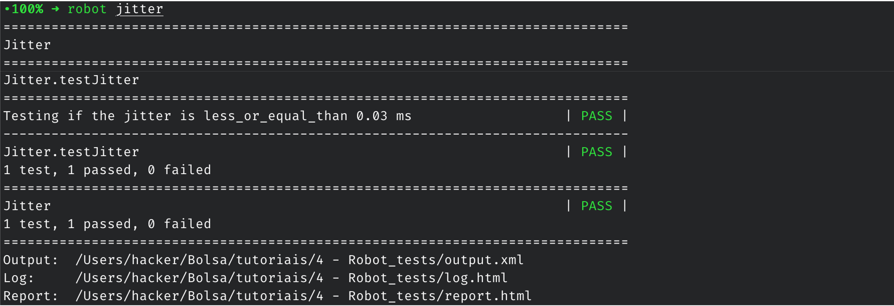
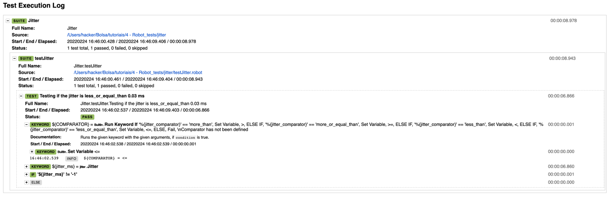

# How to test your VNFs with the Robot Framework

### Robot Framework

For this tutorial, we will use the `Robot Framework`, which is an open source framework that is used to test automation. Obviously, there are similar tools that you can also use.

The robot tests can analyse the connection between 2 VNFs, but they can do a lot of different things. For example, it can test the connection between 2 VMs.

The tests performed for 2 VNFs can be:

* BandWidth
* Open Ports
* Packet Loss
* Transmission Speed
* Jitter
* etc

### Installation

Firs of all, you need to install the robot framework in your machine:

```bash
$ pip install robotframework
$ robot --version
```

In this case, we will be testing the `Jitter`. Before that, create the needed files:

```bash
# create the folder
$ mkdir jitter
$ cd jitter/

# create the files
$ touch jitter.py
$ touch testJitter.robot
```

After that, you can check the structure of your file using the `tree` command:

```bash
.
└── robot_test_tutorial
   └── jitter
       ├── jitter.py
       └── testJitter.robot
```

### Code

To avoid changing the variables in the script, we will use `environment variables`:

```bash
# VNF 1
$ export jitter_host1_ip=10.0.12.223 # change to your VNF 1 IP
# change to your credentials
$ export jitter_host1_username=ubuntu 
$ export jitter_host1_password=password 

# VNF 2
$ export jitter_host1_ip=10.0.12.212 # change to your VNF 2 IP
# change to your credentials
$ export jitter_host1_username=ubuntu 
$ export jitter_host1_password=password 

# Jitter
$ export jitter_comparator=less_or_equal_than 
$ export jitter_threshold=0.03
```

As you can see, we defined the `IP` and `credentials` for both VNFs.

The `username` and `password` also need to be defined because we will be executing commands through SSH.

Finally, the last 2 commands define the `comparator` and the `threshold` for the Jitter.

#### jitter/jitter.py

Now, we can start to edit the python script:


```python
import json
import os
import pip
import importlib.util

host1 = os.getenv('jitter_host1_ip')
username1 = os.getenv('jitter_host1_username')
password1 = os.getenv('jitter_host1_password')

host2 = os.getenv('jitter_host2_ip')
username2 = os.getenv('jitter_host2_username')
password2 = os.getenv('jitter_host2_password')


packages = ['paramiko','robotframework']
for package in packages:
    if (spec := importlib.util.find_spec(package)) is  None:
        pip.main(['install', package])       
    
import paramiko
```

As you can see, we are using the environment variables to define the IPs and credentials of the machines.

After that, we are checking if the needed packages are installed and, if not, install them. This can also be done manually.

The `paramiko` package is used to run commands through SSH in each VNF.

After that initial code, we can make the test function:

```python
#test
def jitter():
    machine1 = paramiko.SSHClient()
    machine1.set_missing_host_key_policy(paramiko.AutoAddPolicy())
    machine2 = paramiko.SSHClient()
    machine2.set_missing_host_key_policy(paramiko.AutoAddPolicy())
    try:
        machine1.connect(hostname=host1, username=username1, password=password1)
        machine2.connect(hostname=host2, username=username2, password=password2)
    except:
        print("[!] Cannot connect to the SSH Server")
        exit()

    # Executing iPerf commands
    machine1.exec_command("iperf3 -s -1")
    stdin, stdout, stderr = machine2.exec_command(f"iperf3 -c {host1} -u --json -t 5")
    iperfResult = stdout.read().decode()
    obj = json.loads(iperfResult)
    try:
        jitter_ms = float(obj['end']['sum']['jitter_ms'])
        print(f"Jitter: {jitter_ms}")
    except:
        return "Not found"
    return jitter_ms


if __name__ == '__main__':
    jitter()
```

In the first part, we are connecting to each VNF using an SSH client from the paramiko package.

Having the connection to the VNFs, in the second part, we are executing the commands to obtain the `Jitter`, using `iperf3`, and then returning it.

#### jitter/testJitter.robot

Now, we will edit our robot file:

```robot
*** Settings ***
Library        jitter.py

*** Test Cases ***
Testing if the jitter is %{jitter_comparator} %{jitter_threshold} ms
    ${COMPARATOR}=       Run Keyword If      '%{jitter_comparator}' == 'more_than'        Set Variable    >
    ...    ELSE IF    '%{jitter_comparator}' == 'more_or_equal_than'        Set Variable    >=
    ...    ELSE IF    '%{jitter_comparator}' == 'less_than'        Set Variable    <
    ...    ELSE IF    '%{jitter_comparator}' == 'less_or_equal_than'        Set Variable    <=
    ...    ELSE     Fail  \nComparator has not been defined


    ${jitter_ms}=    jitter
    IF     '${jitter_ms}' != '-1'
    Should Be True    ${jitter_ms} ${COMPARATOR} %{jitter_threshold}
    ELSE
    FAIL    \nImpossible to compute Jitter
    END
```

In `*** Settings ***`, we are defining the python script to be used (`jitter.py`), which we just created in the previous section.

Inside `*** Test Cases ***` we can define the test itself. 

Firstly, we are assigning the environment variable `jitter_comparator` to the comparator itself. In our case, since our EV had the value `less_or_equal_than`, the comparator will have the value `<=`.

Then, using the returned jitter value from the python script, the robot test will compare it to our threshold, defined in our EV `jitter_threshold` (`0.03`).

#### Iperf3

Before running the test, we need to make sure that the `iperf3` package is installed in the VNFs, so the jitter can be obtained.

For that, you have 2 options:

* Install through SSH command in each VNF : `sudo apt-get install iperf3`
* Through the VNF cloud-init files

### Run the test

Make sure you exported the environment variables.

With that in mind, we can now run our test:

```bash
# In this case, we are checking if the average Jitter between the VNFs is less than 0.03 ms
$ robot jitter # this references the folder
```

If everything goes accordingly, you should obtain this output:



As you can see, the test was successful.

#### Logs

The robot framework automatically generates a `log.html` file that contains the test details:



As it is visible, you get a very detailed description on what happened, like the values obtained and each step of the test.

### Video

For a better description of the tutorial, you can check our video [here](https://www.youtube.com/watch?v=p7zrQcLs9cg)